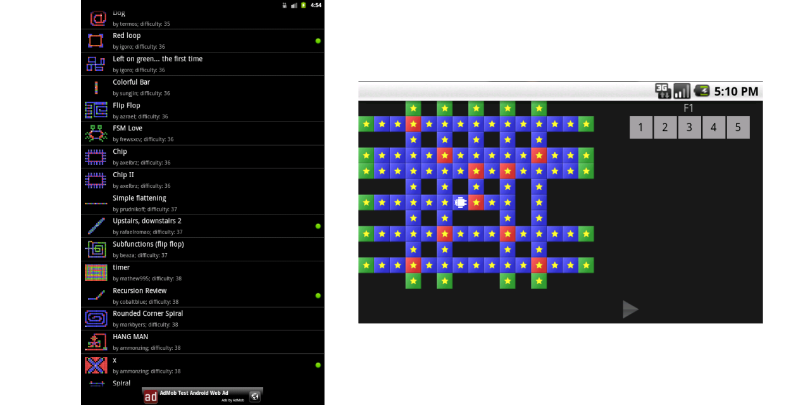

# RoboZZle Droid

An old project I decided to open source.

#

A few of my tools for advanced users on Windows:
- [Stack WM](https://www.microsoft.com/store/apps/9P4RJ8RL7QGS?cid=robozzle) -
tiling window manager with XAML-based configuration.
- [SSHD Wizard](https://apps.microsoft.com/store/detail/sshd-wizard/9P1TS9NVTGML?cid=robozzle) -
combines your SSH and HDD into a SSHD.
